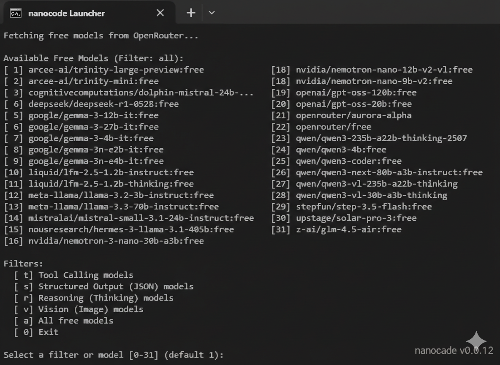

# nanocode

[](https://www.gnu.org/licenses/gpl-3.0)

A minimal, zero-dependency Claude Code alternative. Built with an agentic loop in ~300 lines of Python.

*Inspired by [1rgs/nanocode](https://github.com/1rgs/nanocode)*



## Core Philosophy
Nanocode is designed to be a transparent, simple, and safe coding assistant. It provides a full agentic loop with tool use while ensuring you are always in control of your filesystem and terminal.

## Key Features
- **Smart Context (Auto-Indexing)**: Automatically scans project structure on startup so the AI knows your codebase immediately.
- **Batching & Planning**: Can perform complex, multi-file changes in a single turn.
- **Tools**: `read`, `write`, `edit`, `glob`, `grep`, and `bash`.
- **Safety First**: 
  - **Colored Diffs**: See a preview of file changes (Light Green for additions, Light Red for deletions).
  - **Approval Prompts**: All file writes, edits, and shell commands require manual `y/n` confirmation.
- **Free Model Support**: Automated fetching and selection of currently available free models on OpenRouter.
- **Zero Dependencies**: Runs on standard Python 3 libraries. No `pip install` required.
- **Session Management**: Export conversation history to JSON at any time.

## Quick Start

### 1. Setup Environment
Copy the example environment file and add your OpenRouter API key:
```bash
cp .env.example .env
# Open .env and add: OPENROUTER_API_KEY=your_key_here
```

### 2. Launch
Use the cross-platform launchers to automatically set up yours environment and pick a free model:

**Windows:**
```batch
.\nanocode.bat
```

**Linux / macOS:**
```bash
chmod +x nanocode.sh
./nanocode.sh
```

### 3. (Optional) Global Installation
You can make `nanocode` available as a command anywhere on your system.

**Prerequisites:**
- [Node.js & NPM](https://nodejs.org/) installed.
- `python` added to your system PATH.

**Setup Global Command:**
Run this in the project root:
```bash
npm link
```
Now you can simply type `nanocode` in **any directory** on your system to launch it! It will automatically target the current folder you are in.

**How to Update:**
Since `npm link` creates a symlink to this directory, any changes you make (or `git pull`) here are **automatically applied** globally. You don't need to run it again unless you move the folder.

## Commands
Inside the assistant, use these slash commands:
- `/h` - **Help**: Show available commands.
- `/s` - **System Info**: View OS, Python version, current Model, and Provider.
- `/save` - **Save**: Export the current session history to a timestamped JSON file.
- `/fix` - **Fix**: Analyze the last error or terminal state and propose a repair.
- `/c` - **Clear**: Reset the conversation history.
- `/q` or `exit` - **Quit**: Safely exit the application.

## Tools
| Tool | Description |
|------|-------------|
| `read` | Read files with line numbers and optional offset/limit. |
| `write` | Create or overwrite files (requires approval). |
| `edit` | Replace specific strings in files (requires approval). |
| `glob` | Search for files using patterns (sorted by modification time). |
| `grep` | Search file contents using regex. |
| `bash` | Execute shell commands (requires approval). |

## License
GPL v3
